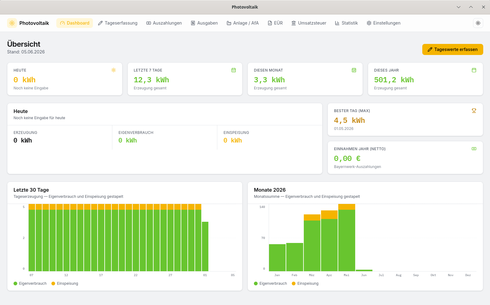

# Photovoltaik

Selbst gehosteter Photovoltaik-Manager als Desktop-Anwendung. Erfasst
Tageserzeugung, Eigenverbrauch und Einspeisung, verwaltet
Bayernwerk-Auszahlungen, Betriebsausgaben und Anlagengüter und erzeugt
daraus die Einnahmen-Überschuss-Rechnung (EÜR) und die
Umsatzsteuer-Voranmeldung (UStVA) für das Finanzamt.

*Self-hosted photovoltaic manager as a desktop application. Tracks daily
generation, self-consumption and grid feed-in, manages distribution-grid
payouts (Bayernwerk), operating expenses and capital assets, and produces the
German income statement (EÜR) and VAT advance return (UStVA) from the
collected data.*



---

## Deutsch

### Funktionen

- **Tageserfassung** — Erzeugung, Eigenverbrauch, Einspeisung und
  optional Netzbezug pro Tag mit Plausibilitätsprüfung.
- **Auszahlungen** — Verwaltung der Bayernwerk-Gutschriften
  (Buchungsdatum, Abrechnungszeitraum, netto/USt/brutto, kWh) mit
  Plausibilitätshinweisen gegen die erwartete Einspeisevergütung und
  Anzeige der EEG-Restlaufzeit.
- **Betriebsausgaben** — kategorisiert, mit Vorsteuer-Flag.
- **Anlagenverzeichnis** — lineare AfA mit pro-rata-temporis im
  Erstjahr (Default-Nutzungsdauer 20 Jahre, BMF-AfA-Tabelle), GWG-
  Sofortabzug §6 Abs. 2 EStG, Sonder-AfA §7g Abs. 5 EStG und
  Anlagenabgang mit Restbuchwert und Veräußerungserlös.
- **EÜR** pro Jahr und **UStVA** pro Monat oder Jahr — direkt aus den
  erfassten Daten berechnet.
- **Drei orthogonale Verlaufs-Achsen** — der jeweils am Buchungstag
  gültige Eintrag wirkt auf die Berechnung:
  - **USt-Modus**: `regel` (19% inkl. Eigenverbrauchsbesteuerung),
    `kleinunternehmer` (§19 UStG), `nullsteuer` (§12(3) UStG ab 2023).
  - **Betreiber-Status**: `gewerblich` (voll EÜR-pflichtig) oder
    `privat` (§3 Nr. 72 EStG, einkommensteuerbefreit für PV ≤30 kWp).
  - **Einspeisevergütung**: `ueberschuss` / `voll` / `direktvermarktung`
    mit Satz in ct/kWh.
- **Stromtarif-Verlauf** — Arbeitspreis (€/kWh) und optional Grundgebühr;
  speist die taggenaue Privat-Ersparnis aus dem Eigenverbrauch.
- **Statistik** — Aggregate für Tag, Monat, Jahr und Max-Tag,
  Eigenverbrauchsquote und Autarkiegrad.
- **CSV-Export** der Buchungen für EÜR und UStVA, Anlagenverzeichnis als
  CSV (semikolon-getrennt, UTF-8-BOM, Komma-Dezimaltrenner).
- **Print-Layout** — A4-Druck der EÜR- und UStVA-Reports via
  `window.print()` mit ausgeblendeten Filtern und Druck-Header.
- **JSON-Backup/Restore** — vollständiger Dump aller Tabellen,
  Restore in einer Transaktion.
- **Lokale SQLite-Datenbank** (`photovoltaik.db` neben der Executable,
  WAL-Journal), keine Cloud-Abhängigkeit.

### Stack

- Tauri 2 (Rust-Backend) + SvelteKit 2 (`adapter-static`, kein SSR) +
  Svelte 5 (runes)
- TailwindCSS 4, handgeschriebene UI-Primitives im shadcn-svelte-Stil
- SQLite via `rusqlite` (bundled)
- Bun als Package-Manager

### Voraussetzungen

- [Bun](https://bun.sh/)
- Rust-Toolchain (`rustup`)
- System-Abhängigkeiten für Tauri 2 — siehe
  [Tauri-Prerequisites](https://v2.tauri.app/start/prerequisites/)

### Entwicklung

```bash
bun install
bun run tauri dev    # vollständige App (Vite :1420 + Tauri-Fenster)
bun run check        # svelte-kit sync && svelte-check (Typecheck-Gate)
bun run tauri build  # Release-Installer für die aktuelle Plattform
```

`bun run dev` startet nur das Frontend; ohne Tauri-Runtime werfen alle
API-Aufrufe einen klaren Fehler („erfordert Desktop-App").

### Konfiguration

Beim ersten Start wird `photovoltaik.db` neben der Executable angelegt.
Unter *Einstellungen* werden gepflegt:

- USt-Modus-Verlauf mit `effective_from`-Daten
- Betreiber-Status-Verlauf (`gewerblich` / `privat`)
- Einspeisevergütungs-Verlauf (Modell + Satz in ct/kWh)
- Stromtarif-Verlauf (Arbeitspreis + optionale Grundgebühr)
- Aktueller USt-Satz für die Regelbesteuerung (Default 19%)
- Eigenverbrauchspreis (€ pro kWh) für die Bemessung der unentgeltlichen
  Wertabgabe
- Strom-Bezugspreis als Fallback für die Ersparnis-Berechnung
- API-URL und Token für den optionalen Hersteller-Import (Stub)

### Hersteller-Import

Der Command `import_from_vendor(von, bis)` existiert als Stub. Der
konkrete HTTP-Adapter (Anker SOLIX / Fronius Solar.Web / SMA Sunny Portal)
wird ergänzt, sobald die API-Spezifikation feststeht. Bis dahin werden die
Tageswerte manuell erfasst.

### Haftungsausschluss

Die Berechnungen für EÜR und UStVA orientieren sich an gängiger Auslegung
der relevanten Vorschriften (insb. BMF-Schreiben vom 27.02.2023 zu §12(3)
UStG). Sie ersetzen keine steuerliche Beratung. Die Verantwortung für die
korrekte Steuererklärung liegt beim Anwender.

### Lizenz

MIT — siehe Header in `package.json`.

---

## English

### Features

- **Daily entry** — generation, self-consumption, grid feed-in and
  optional grid draw per day with consistency checks.
- **Payouts** — manage distribution-grid credit notes (booking date,
  billing period, net/VAT/gross, kWh) with plausibility hints against
  the expected feed-in tariff and remaining EEG term.
- **Operating expenses** — categorised, with input-VAT flag.
- **Asset register** — linear depreciation (*AfA*) with
  pro-rata-temporis in the first year (default useful life 20 years per
  the BMF depreciation table), low-value asset write-off (§6 Abs. 2
  EStG), special depreciation (§7g Abs. 5 EStG) and asset disposal with
  residual book value and sale proceeds.
- **Annual EÜR** (income statement) and **monthly or annual UStVA** (VAT
  advance return) computed directly from the recorded data.
- **Three orthogonal history axes** — the entry valid on the booking
  date drives the calculation:
  - **VAT mode**: `regel` (19% incl. self-consumption taxation),
    `kleinunternehmer` (§19 UStG), `nullsteuer` (§12(3) UStG since 2023).
  - **Operator status**: `gewerblich` (commercial, fully EÜR-liable) or
    `privat` (§3 Nr. 72 EStG, income-tax-exempt for PV ≤30 kWp).
  - **Feed-in tariff**: `ueberschuss` / `voll` / `direktvermarktung`
    with the rate in ct/kWh.
- **Electricity tariff history** — energy price (€/kWh) and optional
  base fee; drives the day-accurate private savings from self-consumption.
- **Statistics** — day/month/year aggregates, peak day, self-consumption
  ratio and self-sufficiency ratio.
- **CSV export** of bookings for EÜR and UStVA, and of the asset
  register (semicolon-separated, UTF-8 BOM, comma decimal separator).
- **Print layout** — A4 printing of EÜR and UStVA reports via
  `window.print()` with filters hidden and a print header.
- **JSON backup / restore** — complete dump of all tables, restore in a
  single transaction.
- **Local SQLite database** (`photovoltaik.db` next to the executable,
  WAL journal); no cloud dependency.

### Stack

- Tauri 2 (Rust backend) + SvelteKit 2 (`adapter-static`, no SSR) +
  Svelte 5 (runes)
- TailwindCSS 4, hand-written UI primitives following shadcn-svelte
  conventions
- SQLite via `rusqlite` (bundled)
- Bun as package manager

### Prerequisites

- [Bun](https://bun.sh/)
- Rust toolchain (`rustup`)
- Tauri 2 system dependencies — see
  [Tauri prerequisites](https://v2.tauri.app/start/prerequisites/)

### Development

```bash
bun install
bun run tauri dev    # full app (Vite :1420 + Tauri window)
bun run check        # svelte-kit sync && svelte-check (typecheck gate)
bun run tauri build  # release installer for the current platform
```

`bun run dev` starts the frontend only; without the Tauri runtime every
API call throws a clear error ("desktop app required").

### Configuration

On first launch `photovoltaik.db` is created next to the executable.
The *Settings* page exposes:

- VAT-mode history with `effective_from` dates
- Operator-status history (`gewerblich` / `privat`)
- Feed-in tariff history (model + rate in ct/kWh)
- Electricity-tariff history (energy price + optional base fee)
- Current VAT rate for standard taxation (default 19%)
- Self-consumption price (€ per kWh) used to value the deemed supply
- Grid electricity price as fallback for the savings calculation
- API URL and token for the optional vendor import (stub)

### Vendor import

The `import_from_vendor(von, bis)` command exists as a stub. The
concrete HTTP adapter (Anker SOLIX / Fronius Solar.Web / SMA Sunny
Portal) will be added once the API specification is finalised. Until
then, daily values are entered manually.

### Scope and disclaimer

The EÜR and UStVA calculations follow the prevailing interpretation of
the relevant German tax rules (notably the BMF letter of 2023-02-27 on
§12(3) UStG). This application is **not a substitute for professional
tax advice**. Responsibility for the correctness of the tax filing
remains with the user.

### Localisation

The user interface and all stored field names are German. An English
translation layer is not currently planned — the application targets
German PV operators filing with a German tax office.

### License

MIT — see header in `package.json`.
